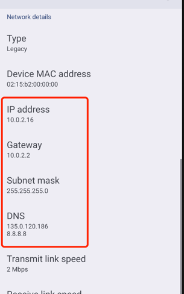

# 绩效考核系统

基于flutter3.29.0和Get的绩效考核系统，涵盖web、ios、android
#  https://fluttericon.cn/   flutter icon 地址

## 开发问题
### 运行到安卓环境失败
* 进入*android*目录，执行以下命令 [Execution failed for task ':app:compileFlutterBuildDebug]
```shell
./gradlew --stop
./gradlew build
./gradlew clean (不一定执行的命令)
```

### 安卓模拟器DNS修改，以支持访问局域网域名,安卓模拟器的wifi改为static，并按如下图修改ip和dns


### 如果出现ndk相关错误： 27.0.12077973
* 修改`<flutter_dir>\flutter\packages\flutter_tools\gradle\src\main\groovy\flutter.groovy`文件中的ndkVersion 为 *27.0.12077973* 
* 在进入*android*目录执行以下命令
```shell
./gradlew --stop
./gradlew build
./gradlew clean (不一定执行的命令)
```

## 更多帮助
For help getting started with Flutter development, view the
[online documentation](https://docs.flutter.dev/), which offers tutorials,
samples, guidance on mobile development, and a full API reference.
